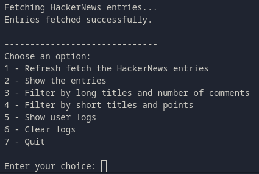

# CrawlerOne

## Project setup

```bash
pyenv local 3.11.7
python -m venv .venv
source .venv/bin/activate
pip install --upgrade pip
pip install -r requirements.txt
pre-commit install        # pre-commit clean
```

## Checks

### Run tests

#### All tests

```bash
pytest
```

#### Unit / Integration tests

```bash
pytest unit
pytest integration
```

### Pre-commit

```bash
git add .
pre-commit run --all-files
```

Note that the pre-commit runs only unit tests, as the integration test fetches real content.

## Run project

```bash
python -m crawler.main
```

## Welcome to Crawler One

### Intro

This is a small crawler adapted to the HackerNews homepage.
It crawls the first 30 entries and allows to filter them by title lenght and a couple of ordering options. It also saves the user interaction data with the filters (time and filter used) using SQLite.

### Structure

The project uses functional programming, TDD and as much strong typing as possible.

There are 3 parts:

- `crawler` where the program resides
- `tests`
- config files

The program runs on console:



### Improvements

This program was build as an assignment, so I didn't go into perfecting it a lot. But I want to list here the improvements I'm aware of and I would make if this was a larger project.

#### `crawler/main.py`

The whole user interaction can be a CLI tool, using [Python click](https://click.palletsprojects.com/en/stable/).

The constants used could be placed in a config file and be retrieved when needed, which offers better management.

#### `crawler/fetcher.py`

The fetching could use some logging, to monitor the calls.
The entries parsing is very specific for the case. Usually crawlers are more general, which would require more abstract functions.
The checks for entries amount are a bit lax. I didn't want the program to be very strict. This part could be improved with a config that specifies the amount of entries needed, for example. Also, a config could define how strict the method should be, for flexibility.

#### `crawler/filters.py`

The filters are specific to the assignment. I separated the title filter from the ordering, and then combined the final filter as needed. This could apply to any kind of filtering that the content needs.

#### `crawler/storage.py`

I used minimal storage with SQLite, without ORM, because the project doesn't require it.
The program could use a cache for the entries a part from storing user interaction.
The db_path is passed as a required parameter to ensure that test use their own DB, and to ensure transparency in the parameters in functions that require storage.

#### `tests/conftest`

I defined some fixtures for the project, for the sake of easier development and to simplify tests.

#### `tests/test_fetcher.py`

I tested a very basic behaviour here: reaching the site, ensuring we raise an error if something goes wrong, getting between 1 and 30 entries and ensuring we raise an error if there were no entries.

Other cases that I might have covered in a finished project:

- Possible use cases with less than 30 entries
- Malformed data (missing subtext, missing points. missing comments)
- Non-integer values (e.g., “5.5 points” → test failure)

#### `tests/test_filters.py`

I tested the title filtering and both final filters.
I didn't test ordering because there's no added logic.

#### `tests/test_integration.py`

I wanted to ensure the whole flow was working correctly, so I added a test that covers:

- reaching the real site
- getting the entries
- executing a filter
- logging the interaction
